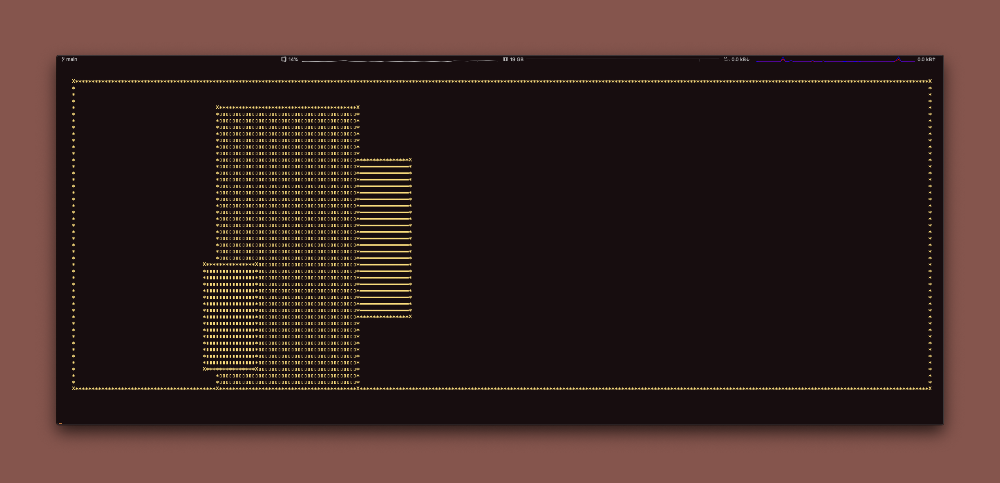
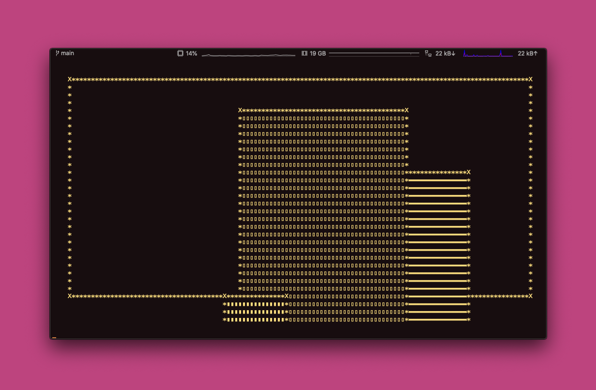
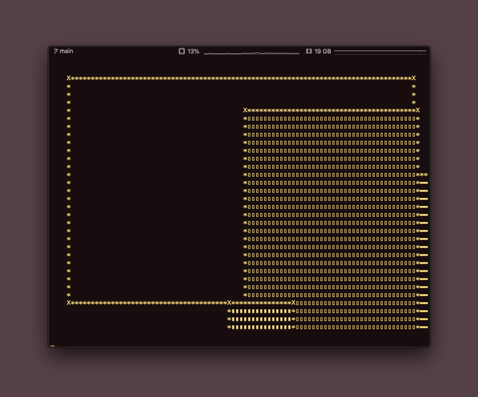

# CLUI

Draw boxes in the terminal.

## Example 

### Example Box
```swift
let padding = 4
    guard let box = buildBox(padding: padding, rects: [
        
        Rect(x: padding,
             y: padding,
             z: -1,
             
             width: cols - (padding * 2),
             height: lines - (padding * 2),
             
             backgroundCharacter: " ",
             borderCharacter: "*",
             cornerCharacter: "X"),
    
        Rect(x: 64, y: 16, z: 0, width: 43, height: 24, backgroundCharacter: "▬"),
        Rect(x: 48, y: 8, z: 1, width: 43, height: 43, backgroundCharacter: "▯"),
        Rect(x: 44, y: 32, z: 5, width: 16, height: 16, backgroundCharacter: "▮")
        
    ]) else {
        defer {
            isRunning = false
        }
        return "Padding is too big!"
    }
```

### Large


### Medium


### Small

